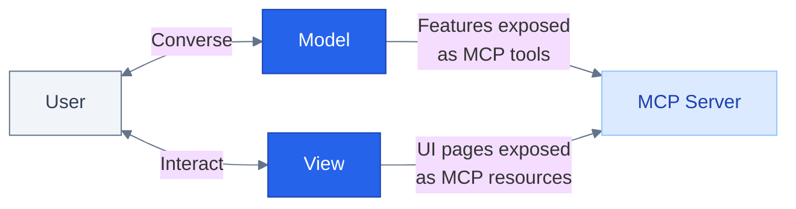

**Problem:** Apps involve three actors (the host, your server, your view) communicating in complex patterns. Understanding this flow is essential.

**Solution:** Frac provides clear abstractions for each communication pattern.

## The Three Actors



1. **The MCP Host**: The conversational interface where users type messages and the model responds (ChatGPT, Claude, Goose, VSCode, etc.)
2. **Your MCP Server**: The backend that exposes tools and business logic
3. **Your View (Guest)**: The React component rendered in an iframe inside the host

## Key Terms

Tool responses contain three fields:

- **`content`**: Text array shown to the model in the conversation
- **`structuredContent`**: Typed JSON data surfaced to your view and the host
- **`_meta`**: Delivered only to the view and hidden from the model

## Tools and views

Before diving into the data flow, understand the difference between plain tools and tools with a view. Both use `registerTool`, differentiated by the optional `view` field:

| | `registerTool` (no `view`) | `registerTool` (with `view`) |
|---|---|---|
| **Has UI?** | No | Yes |
| **Returns** | `content` and/or `structuredContent` | `structuredContent` and optional `content`/`_meta` |
| **Renders** | Nothing | A React component from `src/views/` |
| **Use case** | Background operations, calculations | Interactive UI |

```typescript
// Plain tool: no UI, returns text
server.registerTool(
  { name: "calculate", inputSchema: { /* ... */ } },
  async (args) => {
    return { content: "Result: 42" };
  },
);

// Tool with view: has UI, returns structured data
server.registerTool(
  {
    name: "chart",
    inputSchema: { /* ... */ },
    view: { component: "chart" },
  },
  async (args) => {
    return {
      content: "Displaying chart",
      structuredContent: { data: [1, 2, 3], labels: ["A", "B", "C"] },
    };
  },
);
```

## Data Flow Patterns

### 1. Tool → View (Initial Hydration)

When the host calls a tool returning a view, it returns `structuredContent` to hydrate the React component:

**Server:**
```typescript
server.registerTool(
  {
    name: "show_flights",
    inputSchema: { destination: z.string() },
    view: { component: "show_flights" },
  },
  async ({ destination }) => {
    const flights = await searchFlights(destination);

    return {
      content: `Found ${flights.length} flights`,
      structuredContent: { flights }, // This goes to the view
    };
  },
);
```

**View:**
```tsx
import { useToolInfo } from "frac/web";

export function FlightView() {
  const toolInfo = useToolInfo<{ flights: Flight[] }>();

  if (toolInfo.isSuccess) {
    const { flights } = toolInfo.output.structuredContent;

    return (
      <ul>
        {flights.map(flight => <li key={flight.id}>{flight.name}</li>)}
      </ul>
    );
  }

  return <div>Loading...</div>;
}
```

**Use [`useToolInfo`](/api-reference/use-tool-info) for the initial data** that renders your view. This data is set once when the view loads.

<Note>
**useToolInfo is read-only**

`useToolInfo` provides the initial hydration data and should not be used as a mutable data store. For persistent view state that survives re-renders, use [`useViewState`](/api-reference/use-view-state).
</Note>

### 2. View → Server (Tool Calls)

Views can trigger additional tool calls in response to user actions:

```tsx
import { useCallTool } from "frac/web";

export function FlightView() {
  const { callTool, isPending, data } = useCallTool("get_flight_details");

  const handleViewDetails = (flightId: string) => {
    callTool({ flightId });
  };

  return (
    <button onClick={() => handleViewDetails("AF123")} disabled={isPending}>
      {isPending ? "Loading..." : "View Details"}
    </button>
  );
}
```

**Use [`useCallTool`](/api-reference/use-call-tool) when the user performs an action** that requires fetching more data.

<Warning>
**Don't call tools on mount**

Never wrap `callTool` in a `useEffect` to fetch data on mount. Pass initial data through `structuredContent` instead.

**Why?** Tool calls add latency and model round-trips. You control what initially comes from `structuredContent`, leverage it.
</Warning>

### 3. View → Model (Context Sync)

Your view needs to communicate its state back to the model. Use the **`data-llm` attribute** to declaratively describe what the user sees. See [LLM Context Sync](/concepts/llm-context-sync).

### 4. View → Chat (Follow-up Messages)

Views can send messages back into the conversation:

```tsx
import { useSendFollowUpMessage } from "frac/web";

export function FlightView() {
  const sendMessage = useSendFollowUpMessage();

  const handleBookFlight = (flight: Flight) => {
    sendMessage({
      prompt: `I'd like to book the ${flight.name} flight. What payment methods do you accept?`
    });
  };

  return <button onClick={() => handleBookFlight(selectedFlight)}>Book Now</button>;
}
```

This creates a continuous loop: the view can ask the model for help, and the model responds naturally in the conversation.

<Tip>
**When to use useSendFollowUpMessage vs data-llm**

- **`data-llm`**: For passive context—the model reads it when the user asks a question
- **`useSendFollowUpMessage`**: For active prompts—triggers a new model response immediately

If the model's response triggers another view, the host renders a new view instance (not nested inside the current one).
</Tip>

## Response Fields Explained

Tool responses have three fields:

| Field | Purpose | Consumed by |
|-------|---------|-------------|
| `content` | Text description | The host (shown in conversation) |
| `structuredContent` | Typed data | Host and view (`useToolInfo`, `useCallTool`) |
| `_meta` | Response metadata | View|

```typescript
return {
  content: [{ type: "text", text: "Found 3 flights to Paris" }],
  structuredContent: {
    flights: [{ id: "AF123", name: "Air France 123" }, /* ... */]
  },
  _meta: {
    flightImages: [{ url: "https://assets.airfrance.com/flights/AF123.jpg" }, /* ... */]
  }
};
```

## When to Use What

| Need | Use | Why |
|------|-----|-----|
| Initial view data | `useToolInfo` | Data passed at hydration, no extra calls |
| User-triggered fetch | `useCallTool` | Model sees the result, can answer questions |
| Silent background fetch | Direct API call | Model doesn't need to know |
| Describe current UI state | `data-llm` | Passive context for user questions |
| Trigger model response | `useSendFollowUpMessage` | Active prompt, immediate reply |
| Persist view state | `useViewState` | Survives re-renders |

<Tip>
**Why useCallTool instead of a direct API call?**

`useCallTool` adds the result to the **conversation context**. This means:
- User asks "What's the baggage limit?" → Model can answer using the flight details from context
- User says "Compare this with the previous one" → Model has both results in context

Direct API calls don't add to context. Use them only for data the model doesn't need (analytics, logging, UI-only updates).
</Tip>

<Warning>
**Direct fetch requires CSP configuration**

If you use `fetch()` directly from views, you need to configure Content Security Policy (CSP) headers. The host blocks requests to domains not explicitly allowed. Add allowed domains to `view.csp.connectDomains` in your `registerTool` call. See [registerTool](/api-reference/register-tool).
</Warning>

## The Communication Loop

1. **Host calls your tool** → Server responds with `structuredContent`
2. **View hydrates** with [`useToolInfo`](/api-reference/use-tool-info)
3. **User interacts** → View updates `data-llm` → Model sees the context
4. **User triggers action** → View calls [`useCallTool`](/api-reference/use-call-tool) → Server responds
5. **View sends follow-up** → [`useSendFollowUpMessage`](/api-reference/use-send-follow-up-message) → Model replies

This loop creates a seamless experience where the conversation, the UI, and your backend work together.

## Related

- [LLM Context Sync](/concepts/llm-context-sync) - Keep the model informed of view state (read this next)
- [Fetching Data Guide](/guides/fetching-data) - Patterns for useToolInfo and useCallTool
- [useToolInfo API](/api-reference/use-tool-info) - Initial data access
- [useCallTool API](/api-reference/use-call-tool) - User-triggered data fetching
- [useViewState API](/api-reference/use-view-state) - Persistent view state
